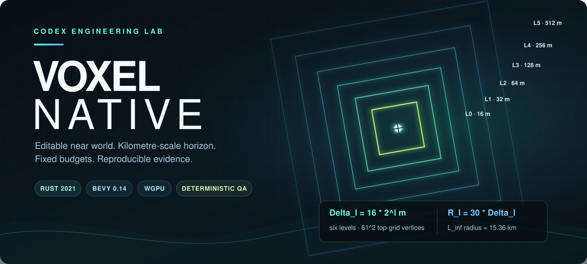
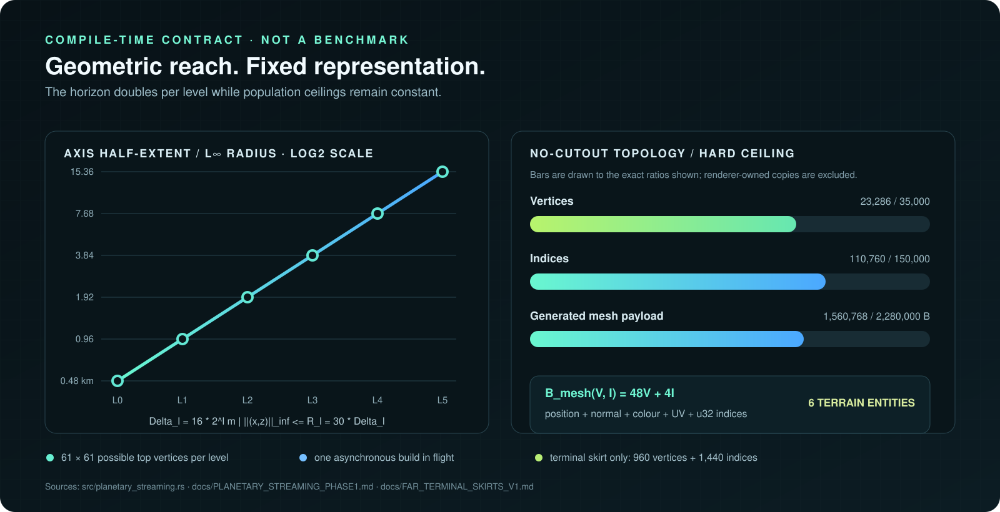
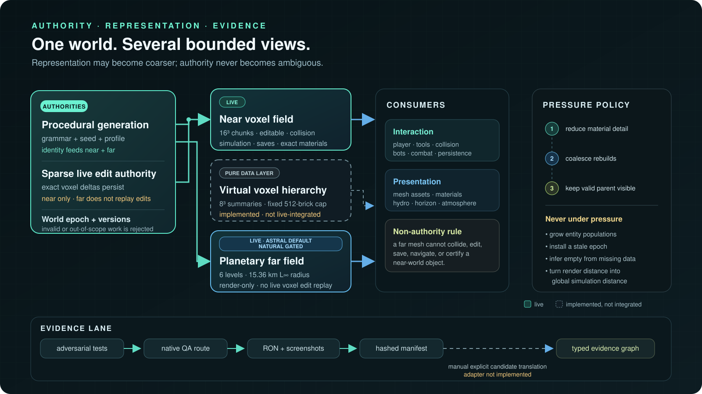
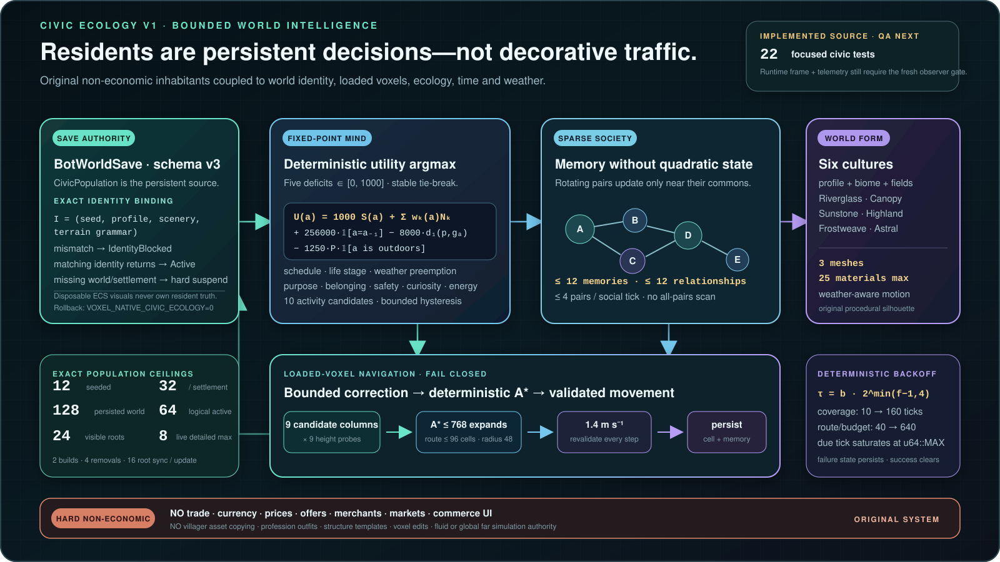
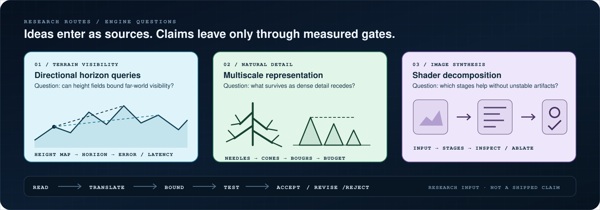

# Voxel Native

<p align="center">
  
</p>

<p align="center">
  <strong>A native Rust voxel engine where editable worlds, kilometre-scale representation, and reproducible evidence are designed as one system.</strong>
</p>

<p align="center">
  <a href="https://github.com/n0t3-droid/voxel-native/actions/workflows/ci.yml"></a>
</p>

<p align="center">
  <a href="docs/CODEX_ENGINEERING_ATLAS.md">Engineering atlas</a> ·
  <a href="docs/releases/technical-preview/voxel-native-codex-engineering-atlas.pdf">Technical atlas PDF</a> ·
  <a href="docs/WORLD_LOOK_CONTINUUM_V1.md">World-look continuum</a> ·
  <a href="docs/CIVIC_ECOLOGY_CONTRACT_V1.md">Civic ecology</a> ·
  <a href="docs/PLANETARY_STREAMING_PHASE1.md">Planetary streaming</a> ·
  <a href="docs/LIVE_OBSERVER_WORKFLOW.md">Live observer</a> ·
  <a href="docs/VOXEL_DISCOVERY_ATLAS.md">Research atlas</a> ·
  <a href="docs/ELITE_WORLD_SYSTEMS_STANDARD.md">Acceptance standard</a>
</p>

Voxel Native is an experimental Rust 2021 engine built with Bevy 0.14 and
wgpu. Its central question is deliberately difficult: how can one world remain
editable at voxel scale, readable across kilometres, deterministic at signed
coordinate extremes, and bounded enough to test honestly?

Codex is the engineering collaborator across this repository: turning research
questions into explicit contracts, implementing the systems, constructing
adversarial tests, running the native engine, and retaining or rejecting work
from evidence. The result is source-first. Claims are tied to code, hard limits,
or reproducible QA—not to a cinematic promise.

The downloadable [Voxel Native Codex Engineering Atlas](docs/releases/technical-preview/voxel-native-codex-engineering-atlas.pdf)
collects the project-authored formulas, diagrams, fixed budgets, failure modes,
rollback boundaries, and evidence rules in one publication. It is a technical
atlas, not a runtime release verdict; the manifest-backed runtime gallery remains
pending its separate visual gate.

## What is real today

| System | Current boundary | Evidence |
| --- | --- | --- |
| Editable voxel authority | Full `16³` chunks drive near terrain, edits, collision, saves, and simulation. Signed world mapping uses Euclidean division. | [`src/chunk.rs`](src/chunk.rs), [`src/world.rs`](src/world.rs) |
| Planetary far field | One finest parent plus five annuli; spacing doubles from 16 m to 512 m and reaches a 15.36 km axis half-extent (`L∞` radius) with exactly six terrain entities. It is live for Astral Frontier by default; Natural remains explicitly gated pending matched visual acceptance. | [`src/planetary_streaming.rs`](src/planetary_streaming.rs), [Phase 1 contract](docs/PLANETARY_STREAMING_PHASE1.md) |
| Seam and handoff logic | Shared integer-world samples, parent morphing, a fail-closed Near-coverage stencil, local GPU coordinates, and a terminal-only horizon skirt. | [Terminal-skirt proof](docs/FAR_TERMINAL_SKIRTS_V1.md) |
| Far hydrography | A gated render-only water/lava layer shares the terrain lattice and retains independent telemetry and hard budgets. It does not claim fluid simulation. | [Hydro v1 contract](docs/FAR_HYDROGRAPHIC_CONTINUITY_V1.md) |
| Near/Far water optics | Near evaluates four exact integer-lattice modes; Far copies the two longest modes and the same bounded CPU phase. Optical response remains opaque, render-only, category-safe, and independent of fluid authority. | [World-look continuum](docs/WORLD_LOOK_CONTINUUM_V1.md), [`src/water.rs`](src/water.rs) |
| Vegetation and atmosphere | Four existing foliage families receive bounded species signatures and analytic normal correction. Sky, fog, lighting, and Natural/Astral grading use a controlled linear-light path. | [World-look continuum](docs/WORLD_LOOK_CONTINUUM_V1.md), [`src/vegetation.rs`](src/vegetation.rs), [`src/daynight.rs`](src/daynight.rs) |
| Autonomous construction | Road-first bot planning uses bounded candidate scoring, footprint reservations, frontage bindings, and smooth deck grades. | [City planner math](docs/CITY_PLANNER_MATH.md) |
| Civic ecology | Twelve original, non-economic residents are persisted inside world authority, coupled to profile/biome fields, scheduled by fixed-point utility, routed only across loaded voxels, and projected through strict simulation and visual LOD ceilings. | [Civic Ecology V1](docs/CIVIC_ECOLOGY_CONTRACT_V1.md), [`src/villagers.rs`](src/villagers.rs) |
| Middle-LOD research layer | A fixed-memory virtual voxel hierarchy is implemented and compile-registered as a pure data layer. It is **not** connected to live rendering, physics, or saves yet. | [Virtual hierarchy status](docs/VIRTUAL_VOXEL_HIERARCHY.md) |
| Evidence tooling | Native routes emit provenance-bound screenshots and RON telemetry. Separately, a typed graph compiler validates explicitly authored JSON evidence candidates; the report/manifest-to-graph adapter is not implemented yet. | [Evidence graph contract](docs/EVIDENCE_GRAPH_CONTRACT.md) |

### Runtime gallery status

The public runtime gallery is intentionally withheld until matched Natural and
Astral routes pass the same-binary visual gate. A future promoted frame must be
linked to an explicit manifest entry naming its route, seed, viewport, profile,
binary SHA-256, evidence status, and known limitation. A completed PNG alone is
not treated as visual acceptance.

## The mathematical core

The far field grows its reach geometrically without growing its topology. For
level `ℓ ∈ {0, …, 5}`:

```text
sample spacing       Δℓ = 16 · 2^ℓ metres
square half-extent   ‖(x, z)‖∞ = max(|x|, |z|) ≤ Rℓ = 30 · Δℓ
shipping L∞ bounds     = 0.48, 0.96, 1.92, 3.84, 7.68, 15.36 km
```

At a level boundary, a three-cell band blends the exact fine height toward a
bilinear sample of the next coarser global lattice:

```text
s(t)       = clamp(t, 0, 1)² · (3 - 2 · clamp(t, 0, 1))
h_display  = h_fine + s(t) · (bilerp(h_parent) - h_fine)
```

Every generated terrain mesh is admitted through an exact payload equation:

```text
Bmesh(V, I) = 48V + 4I bytes
V ≤ 35,000     I ≤ 150,000     Bmesh ≤ 2,280,000
```

These are compile-time and pre-install ceilings, not benchmark averages. The
fixed no-cutout topology and the public envelope are visualized below.

<p align="center">
  <a href="docs/media/planetary-budget-envelope.svg"></a>
</p>

Measured A/B graphs follow the same boundary: matched routes from one release
executable, with metric, sample count, viewport, binary hash, dispersion,
acceptance threshold, and rejected frames stated on the figure. Average FPS is
never substituted for a distribution or for visual inspection.

The [Codex Engineering Atlas](docs/CODEX_ENGINEERING_ATLAS.md) derives the
clipmap recurrence, morph, toroidal cache work, negative-coordinate mapping,
semantic selection ceiling, virtual-brick accounting, city score, and evidence
identity model directly from the implementation contracts.

## A bounded world-look continuum

The visual system is treated as a representation problem, not as a collection
of unrelated effects. Near water, Far Hydro, foliage, atmosphere, fog, and
camera grading preserve explicit ownership boundaries: voxel category and
simulation state remain authoritative on the CPU, while shaders receive only
bounded presentation records.

For water mode `i`, one exact integer lattice vector `qᵢ` defines a spatially
periodic wave vector, and standard deep-water dispersion defines its angular
frequency:

```text
κᵢ = (2π / 4096 m) qᵢ
ωᵢ = √(g ‖κᵢ‖)                    g = 9.80665 m s⁻²
φᵢ(t + Δt) = (φᵢ(t) − ωᵢ Δt) mod 2π
∇h = Σᵢ Aᵢ κᵢ cos(κᵢ·x + φᵢ + δᵢ)
n = normalize((-∂h/∂x, 1, -∂h/∂z))
```

The phase is integrated in bounded CPU state rather than sampled from a
renderer clock that wraps. Near uses four modes; Far receives byte-identical
copies of the two longest records and their phases. This preserves the
low-frequency handoff without creating a second clock, weather response,
texture, queue, or per-ring material. The visible water response uses the
air/water normal-incidence Fresnel term
`F₀ = ((1.333 − 1) / (1.333 + 1))² ≈ 0.0204`; it does not pretend that opaque
PBR is scene refraction or a fluid solver.

Foliage follows the same discipline. A fixed two-band displacement field is
differentiated analytically, and the geometric normal is transformed by the
cofactor of its bounded deformation Jacobian. Across every authored weather
response, the source proof keeps displacement at or below `0.28 voxel`, the
horizontal Jacobian perturbation below `0.12`, and its determinant above
`0.88`. Runtime work remains at most four existing material-uniform writes per
active update; there are no vegetation entities, force fields, colliders, or
animation jobs.

<p align="center">
  <a href="docs/media/world-look-continuum.svg"></a>
</p>

The full [World Look Continuum V1 contract](docs/WORLD_LOOK_CONTINUUM_V1.md)
records units, equations, shader-operation ceilings, uniform sizes, failure
behavior, rollback boundaries, Natural/Astral criteria, and remaining
acceptance work. Source implementation is deliberately distinguished from
visual promotion: a pretty frame is not evidence until its route, viewport,
binary identity, telemetry, and limitations are all retained together.

### Bounded reuse, not unbounded recomputation

One translated cache cell exposes exactly one entering strip per shifted axis.
The diagram separates centre-height sample reuse from mesh assembly and GPU
upload, so the structural count cannot be mistaken for an end-to-end timing
claim.

<p align="center">
  <a href="docs/media/toroidal-cache-reuse.svg"></a>
</p>

## One world, several representations

<p align="center">
  <a href="docs/media/world-representation-architecture.svg"></a>
</p>

The architecture is intentionally asymmetric:

- the Near layer owns interaction, edits, collision, and persistence;
- the far clipmap is descriptive and fixed-cost—it can never become voxel
  authority by accident;
- the virtual hierarchy summarizes occupancy, material, and refinement error,
  but remains a non-live integration layer today;
- render distance does not activate global high-frequency simulation;
- asynchronous work carries epochs: identity-invalid or out-of-authority
  results are rejected before install, while safe retained jobs may be retagged;
- pressure reduces detail before it is allowed to invalidate the horizon or
  exceed a population ceiling.

Natural River Bank V3 is a smaller but equally explicit example: nested smooth
envelopes shape a bed, sediment shelf, and living cap with constant per-column
work. Its units are voxel blocks and dimensionless authored weights; it is not
an erosion or shallow-water simulation, and fresh visual acceptance remains a
separate gate.

<p align="center">
  <a href="docs/media/river-bank-v3-cross-section.svg"></a>
</p>

## Civic ecology, not a marketplace

Settlement life is modeled as bounded world intelligence rather than an economy
or a crowd effect. `CivicPopulation` is persisted with the world, bound to its
exact generation identity, and projected into disposable ECS visuals. A world
identity mismatch freezes the simulation without deleting or reinterpreting its
residents; returning to the matching identity restores authority.

Every activity is chosen from schedule, life stage, weather, five fixed-point
needs, spatial cost, and commitment hysteresis. For candidate activity `a`:

```text
U(a) = 1000 S(a) + Σk wk(a) Nk
       + 256000 · 𝟙[a = aprevious]
       − 8000 · d₁(position, goal(a))
       − 1250 · precipitation · 𝟙[a is outdoors]
```

Navigation never asks unloaded terrain to pretend it is authoritative. A
bounded endpoint correction probes nine nearby columns and nine vertical
offsets; deterministic A* then admits at most `768` expansions, `96` route
cells, a `48`-voxel route radius, `32` queued requests, and `64` cached paths.
Unresolved coverage and blocked routes enter saturating exponential backoff:

```text
retry_delay(failure, n) = base(failure) · 2^min(n − 1, 4)
base(coverage) = 10 ticks       base(route or budget) = 40 ticks
```

The population is equally explicit: `12` seeded residents, at most `32` per
settlement and `128` per world, `64` logically active, `24` visible, and only
`8` full rigs. Social state remains sparse at `12` memories and `12`
relationships per resident. Six culture palettes are caused by world profile,
biome, temperature, mineral resonance, and flowering resonance—not by copied
assets or profession skins.

<p align="center">
  <a href="docs/media/civic-ecology-loop.svg"></a>
</p>

Trading, currency, prices, offers, markets, merchant inventories, and commerce
UI are intentionally absent. Civic residents also cannot mutate voxels; the
construction fleet retains that separate authority. The complete
[Civic Ecology V1 contract](docs/CIVIC_ECOLOGY_CONTRACT_V1.md) records the
equations, constants, failure states, rollback boundary, deterministic tests,
research provenance, and the still-pending fresh native visual gate.

## Codex engineering loop

Every ambitious system follows the same reversible path:

```text
research question
  → explicit authority boundary and failure metric
  → fixed work / memory / population budget
  → implementation with stale-result identity
  → deterministic and adversarial tests
  → one-binary native A/B routes
  → inspect screenshots + telemetry together
  → retain, revise, or roll back
```

This matters because a beautiful frame can conceal unbounded work, while clean
telemetry can conceal a broken horizon. Voxel Native requires both. Novel
optimizations document their baseline, alternatives, distribution, failure
mode, and rollback boundary before they become release claims.

<p align="center">
  <a href="docs/media/city-site-score.svg"></a>
</p>

## Research is visible—and separated from proof

The repository records the source links and decision notes that informed engine
experiments. A source being studied does not mean its technique ships. Each
research route is translated into an engine question and then accepted,
deferred, or rejected under an explicit budget.

<p align="center">
  <a href="docs/media/research-routes.svg"></a>
</p>

Primary research routes: the
[Virtual Horizon Method](https://publications.ibpsa.org/conference/paper/?id=bs2025_1302),
[multiscale shaders for realistic pine-tree rendering](https://graphicsinterface.org/proceedings/gi2000/gi2000-19/),
and [Generative Adversarial Shaders](https://arxiv.org/abs/2306.04629).

The evidence path is just as explicit as the algorithms. Current canonical
dossiers consume one bounded manifest directly; the typed evidence graph is a
separate implemented data contract whose report/manifest adapter is still
missing. The dashed lane below makes that gap visible instead of implying an
integration that does not exist.

<p align="center">
  <a href="docs/media/evidence-lineage.svg"></a>
</p>

Start with the [Voxel Discovery Atlas](docs/VOXEL_DISCOVERY_ATLAS.md) for the
cross-domain map, then read the
[far-world architecture decision](docs/FAR_WORLD_RENDERING_RESEARCH.md) for the
primary-source-to-implementation trail. Links point to the original publishers;
their papers are research inputs, not a claim that Voxel Native reproduces the
published results.

## Build and run

The native engine needs a current stable Rust toolchain and a graphics adapter
supported by wgpu. Python 3.10 or newer is required for evidence and publication
tooling, not for an ordinary engine build. The WebAssembly target is a
compile-only verification gate; it is not a browser-runtime acceptance claim.

| Host | Additional prerequisites | Current verification boundary |
| --- | --- | --- |
| Windows | Rust's MSVC toolchain, Visual Studio Build Tools with the Desktop development with C++ workload and a Windows SDK | Primary native-development and visual-QA host. CI also builds the release executable and exercises the static launcher contract on `windows-latest`. |
| Ubuntu / Debian | `libasound2-dev` and `libudev-dev` in addition to the normal compiler and linker toolchain | CI runs formatting, Clippy, the release build, and Rust tests on Ubuntu without opening a GPU window. |
| macOS | Xcode Command Line Tools | Bevy/wgpu has a Metal path, but this repository currently has no macOS CI or accepted native visual-QA route; treat it as unverified. |

The typed evidence-graph tests use only Python's standard library. The optional
L0 image diagnostic uses Pillow, NumPy, and SciPy. Regenerating the technical
atlas uses the separately pinned dependencies in
`tools/artifacts/requirements-atlas.txt`.

```powershell
git clone https://github.com/n0t3-droid/voxel-native.git
cd voxel-native
rustup target add wasm32-unknown-unknown
python -m pip install -r tools/qa/requirements.txt
python -m pip install -r tools/artifacts/requirements-atlas.txt

# Incremental development build
cargo run

# Optimized native engine
cargo run --release
```

Astral Frontier worlds enable the planetary far field by default. Natural-world
far terrain is still a visual-acceptance route, so it requires the explicit
process-local gate:

```powershell
$env:VOXEL_NATIVE_PLANETARY_STREAMING = 'all'
cargo run --release
```

### Keep one visible engine open (Windows + PowerShell 7 only)

On Windows, the isolated Live Observer keeps one release engine visible while
Codex moves the camera to the system being inspected. Its launcher currently
requires PowerShell 7 and the native `voxel-native.exe`; no Linux or macOS
observer support is claimed. It creates a unique local session and world, leaves
the OS cursor released, does not read or write the normal settings file, and
accepts labelled camera poses and one-shot screenshot requests through its RON
control file—without OS-level input injection.

```powershell
# Verify/build the release, launch a Natural river view, then return this shell after readiness.
.\scripts\live-observer.ps1 -Profile natural -Focus river
```

Camera and control-file changes apply during that session. Compiled Rust does
not hot-reload; batch source changes, then perform one deliberate release
rebuild and observer restart. The [Live Observer workflow](docs/LIVE_OBSERVER_WORKFLOW.md)
documents exact launch options, sequenced view steering, screenshots, readiness
signals, and clean shutdown.

Core controls:

| Input | Action |
| --- | --- |
| `W` `A` `S` `D` + mouse | Move and look |
| `Space` / `Shift` | Fly up / down |
| `Ctrl` | Sprint |
| `F3` | Open engine tools |
| `Esc` | Release pointer / pause |

## Verify a change

```powershell
cargo fmt --all -- --check
cargo clippy --all-targets --all-features
cargo test --workspace --quiet
cargo check --target wasm32-unknown-unknown --bin voxel-native
python -B -m unittest discover -s tools/evidence/tests -p "test_*.py" -v
python -B -m unittest tools.qa.test_analyze_l0_provenance -v
python -B tools/artifacts/test_build_codex_engineering_atlas.py
python -B tools/artifacts/build_codex_engineering_atlas.py --check-only
.\scripts\elite-release-gates.ps1
```

Visual and streaming changes additionally require a unique native QA world,
the documented viewport/DPI matrix, and inspection of every screenshot plus
its `report.ron`. See [Responsive Visual QA](docs/RESPONSIVE_VISUAL_QA.md) and
the [Elite World Systems Standard](docs/ELITE_WORLD_SYSTEMS_STANDARD.md).

## Repository map

| Path | Responsibility |
| --- | --- |
| `src/world.rs`, `src/chunk.rs` | world authority, coordinates, streaming, edit ownership |
| `src/terrain.rs`, `src/mesher.rs` | deterministic terrain fields and voxel meshing |
| `src/planetary_streaming.rs` | fixed-topology far terrain, morphing, hydro, telemetry |
| `src/virtual_voxel_hierarchy.rs` | pure fixed-memory middle-LOD data layer |
| `src/sketch_model.rs`, `src/sculpt/` | direct modeling and sculpt transforms |
| `src/city.rs`, `src/bots.rs` | road graph, bounded planning, bot construction |
| `src/qa.rs`, `scripts/` | native route capture, reports, release gates |
| `docs/` | acceptance contracts, research provenance, decisions, known limits |

## License status

No reuse license has been declared yet. Public visibility does not grant a
license to copy, modify, or redistribute the source or the original diagrams in
`docs/media/`; they remain under default copyright until the maintainers choose
and publish an explicit license. Linked research remains governed by its
original publisher and author terms.

Voxel Native is active pre-release engineering. Default-off diagnostics,
unaccepted visual candidates, research prototypes, and historical benchmark
results are labeled as such; they are not silently presented as shipped
capability.
