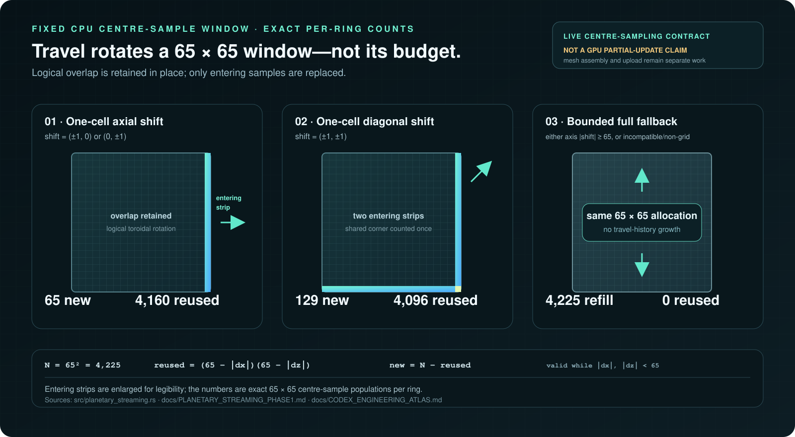
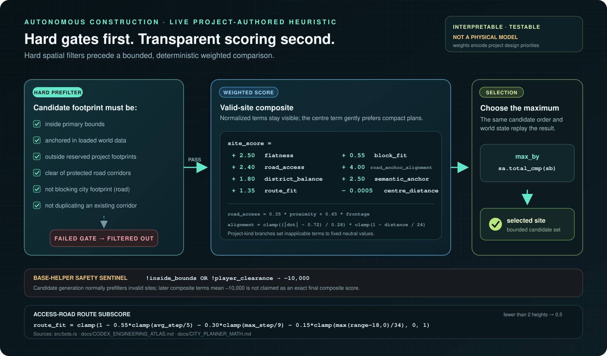
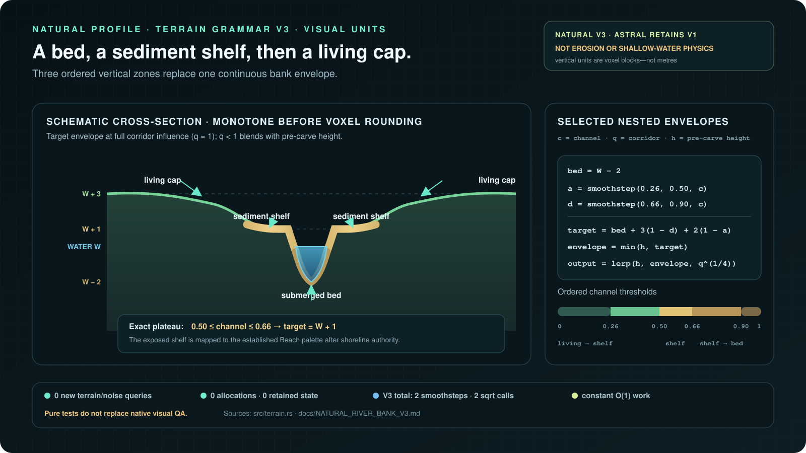
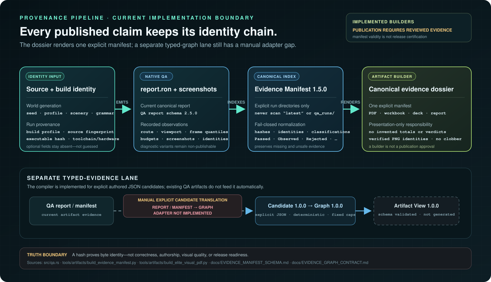

# Codex Engineering Atlas

Status: public technical map of verified, currently implemented contracts.

Download the rendered [Voxel Native Codex Engineering Atlas PDF](releases/technical-preview/voxel-native-codex-engineering-atlas.pdf).
The PDF is a project-authored technical atlas, not a runtime release verdict;
its runtime gallery remains pending the separate manifest-backed visual gate.

This atlas explains the mathematics and evidence boundaries behind Voxel
Native without turning research ideas or rejected diagnostics into release
claims. It is intentionally formula-first: every number below is either a
constant in the current source, an exact consequence of those constants, or a
limit in a checked implementation contract.

The project-specific compositions—such as the city-site score, cohort selector,
cache ownership rules, and evidence identity scheme—are engineering designs for
this engine. They are not presented as new general mathematical theorems.

## Reading the status labels

| Label | Meaning |
| --- | --- |
| **Live** | Connected to the native runtime and visible or authoritative in the engine. |
| **Gated** | Implemented and testable behind an explicit mode; its narrower acceptance status is stated. |
| **Pure layer** | Implemented and compile-registered, but not connected to the live renderer, simulator, or save pipeline. |
| **Research** | A studied source or candidate. It is not an implementation claim. |

## Formula index

| Construction | Exact form | Runtime status |
| --- | --- | --- |
| Clipmap spacing | `Δℓ = 16 · 2^ℓ m`, `ℓ ∈ {0, …, 5}` | **Live** for Astral; **Gated** for Natural |
| Clipmap `L∞` radius | `‖(x, z)‖∞ = max(|x|, |z|) ≤ Rℓ = 30 · Δℓ` | **Live** for Astral; **Gated** for Natural |
| Generated terrain payload | `Bmesh(V, I) = 48V + 4I` bytes | **Live** for Astral; **Gated** for Natural |
| LOD morph | `lerp(hfine, bilerp(hparent), smoothstep(t))` | **Live** for Astral; **Gated** for Natural |
| Signed voxel mapping | `chunk = x divₑ 16`, `local = x modₑ 16` | **Live** |
| Near-coverage workset | `33² + ceil(60² / 64) · 8 = 1,545 B` | **Live** |
| Hydro maximum per ring | `3,721` vertices, `21,600` indices, `265,008 B` | **Gated** |
| Cohort supertile selector | exactly one selected cell per complete `8 × 8` semantic supertile | **Gated**, visual acceptance pending |
| Summary-brick payload | `8³ · 4 = 2,048 B` | **Pure layer** |
| City candidate score | bounded weighted score plus hard invalidation | **Live** |
| Evidence node identity | `kind : sha256(canonical_json(identity))` | tooling contract |

## 1. Constant-topology planetary reach

The far terrain has six levels. Every level uses `60 × 60` cells and therefore
at most `61 × 61 = 3,721` top vertices. It is live for Astral Frontier by
default; Natural requires the explicit `all` profile gate pending matched visual
acceptance. Level spacing doubles, while the number of levels and possible
vertices does not:

```text
L  ΔL (metres)  RL = 30ΔL
0       16         480 m
1       32         960 m
2       64       1,920 m
3      128       3,840 m
4      256       7,680 m
5      512      15,360 m
```

The recurrence is:

```text
Δℓ = 16 · 2^ℓ
Rℓ = (60 / 2) · Δℓ = 30 · Δℓ
```

`Rℓ` is the square topology's axis half-extent, equivalently the maximum
Chebyshev norm over the square: `‖(x, z)‖∞ = max(|x|, |z|) ≤ Rℓ`. Equality
holds on the outer square boundary. It is not a circular Euclidean radius; an
outer corner is `Rℓ√2` from the centre.

This is why adding visible distance does not mean adding dense voxel chunks.
Travel changes absolute sample coordinates and toroidal cache origins; it does
not add a seventh terrain entity or an unbounded history.

### Exact generated mesh envelope

Each terrain vertex stores position, normal, colour, and UV:

```text
(3 + 3 + 4 + 2) f32 = 12 · 4 = 48 bytes per vertex
u32 index                         = 4 bytes per index

Bmesh(V, I) = 48V + 4I
```

The public terrain ceilings are:

```text
V ≤ 35,000
I ≤ 150,000
Bmesh ≤ 48 · 35,000 + 4 · 150,000
      ≤ 2,280,000 bytes
```

With no Near-coverage cutout, the terminal-skirt topology test proves:

```text
top + skirt vertices = 23,286
top + skirt indices  = 110,760
generated payload    = 1,560,768 bytes
```

Only the terminal L5 perimeter closes the finite horizon. Its exact addition is
`60 · 4 · 4 = 960` vertices and `60 · 4 · 6 = 1,440` indices. Repeating that
skirt on inner rings is forbidden because it creates camera-facing walls inside
the annuli.

Sources: [`src/planetary_streaming.rs`](../src/planetary_streaming.rs),
[`FAR_TERMINAL_SKIRTS_V1.md`](FAR_TERMINAL_SKIRTS_V1.md).

## 2. Seam morphing without global floating-point coordinates

Each ring owns an integer-world anchor and local `f32` mesh positions. Let the
Chebyshev distance from a vertex to the ring centre be:

```text
d = max(|xlocal|, |zlocal|)
w = 3Δℓ
t = clamp((d - (Rℓ - w)) / w, 0, 1)
s(t) = t²(3 - 2t)
```

The display height in the three-cell outer band is:

```text
hdisplay = hfine + s(t) · (bilerp(hparent) - hfine)
```

The parent interpolation is evaluated on the next coarser **global integer
lattice**. Common lattice coordinates therefore agree across levels, including
negative world positions. Vertices remain small local values for the GPU,
while sampling identity remains exact in integer world space.

The transition has two useful boundary properties:

```text
s(0) = 0    → exact fine height
s(1) = 1    → exact parent-lattice height
s′(0) = s′(1) = 0
```

Those derivative properties reduce a sharp grade change; they do not certify
that a terrain silhouette is visually acceptable. Native route inspection is
still required.

## 3. Toroidal sampling and fail-closed Near handoff

Each level owns one fixed `65 × 65` source window: `61 × 61` render positions
plus a two-cell halo on every side. In the canonical centre-sample path:

```text
one axial cell shift       → 65 entering samples
one diagonal cell shift    → 65 + 65 - 1 = 129 entering samples
large incompatible shift  → refill the same fixed window
```

The subtraction avoids double-sampling the shared corner. A window moves into
the sole asynchronous worker rather than being cloned, so resident storage and
in-flight work share the same fixed ownership envelope.

The finest ring is a visible safety parent. Near terrain removes a parent cell
only after current-request coverage is proven. The exact workset is:

```text
Near readiness               = 33 · 33 bools = 1,089 B
finest parent mask           = ceil(3,600 / 64) u64
                              = 57 · 8       =   456 B
total                        =                 1,545 B
```

Unknown, missing, stale, or unrepresentable coverage retains the parent. Newly
proven coverage waits for a `0.5 s` stability window; coverage loss restores the
parent immediately. This asymmetry favors a temporary overlap over a sky hole.

<p align="center">
  <a href="media/toroidal-cache-reuse.svg"></a>
</p>

## 4. Signed coordinates are algebra, not a special case

Voxel Native uses Euclidean quotient and remainder for world partitioning:

```text
x = 16q + r
q = x divₑ 16
r = x modₑ 16, where 0 ≤ r < 16
```

Examples:

```text
x =  15  → q =  0, r = 15
x =   0  → q =  0, r =  0
x =  -1  → q = -1, r = 15
x = -16  → q = -1, r =  0
```

Truncation toward zero would map `-1` to the wrong side of the origin. The same
Euclidean rule appears in chunk lookup, ring snapping, material cells, virtual
bricks, and semantic supertiles. Checked `i64`/`i128` intermediates reject
unrepresentable operations instead of wrapping coordinates into another place.

Source: [`src/chunk.rs`](../src/chunk.rs).

## 5. Render-only hydrography under a separate budget

Hydrographic Continuity v1 is a gated presentation layer. It classifies exact
terrain-lattice vertices and emits only conservative top quads. It adds no flow
graph, collider, save record, fluid tick, or voxel authority.

For one fully wet ring:

```text
vertices ≤ 61² = 3,721
indices  ≤ 60² · 6 = 21,600
payload  ≤ 3,721 · 48 + 21,600 · 4
         ≤ 265,008 bytes
```

Across six rings, the compile-time ceilings are `22,326` fluid vertices,
`129,600` fluid indices, `1,590,048` generated bytes, and six fluid entities.
Dry rings create no fluid entity. Water and lava categories retain independent
telemetry so their sum must equal total fluid indices and each count must remain
divisible by the six indices emitted per quad.

This layer is descriptive. Transparency, refraction, foam, depth, buoyancy, and
flow simulation are explicitly outside its claim.

Source: [`FAR_HYDROGRAPHIC_CONTINUITY_V1.md`](FAR_HYDROGRAPHIC_CONTINUITY_V1.md).

## 6. A deterministic sparse-silhouette selector

Far Semantic Cohorts v1 is implemented behind a default-off gate and does not
yet have accepted native visual evidence. Its mechanics are nevertheless a
useful example of converting random-looking placement into an exact ceiling.

Semantic identity uses a 1,024 m grid. For cell `(cx, cz)`:

```text
sx = cx divₑ 8
sz = cz divₑ 8
rx = cx modₑ 8
rz = cz modₑ 8

(px, pz) = two deterministic coordinates in [0, 7]
            derived from grammar, seed, profile, sx, sz

admit(cx, cz) ⇔ rx = px ∧ rz = pz
```

Exactly one semantic cell is selected in every complete Euclidean `8 × 8`
supertile. A window spanning at most 61 semantic cells can intersect at most
nine supertiles on either axis, giving the public Cartesian ceiling:

```text
candidates ≤ 9 · 9 = 81
```

The shipping 512 m L5 alignment makes the actual geometric bound tighter, but
the established allocation and validation ceiling intentionally remains 81.
Each admitted placeholder has 24 vertices and 36 indices, so the compatibility
envelope is:

```text
vertices ≤ 81 · 24 = 1,944
indices  ≤ 81 · 36 = 2,916
payload  ≤ 1,944 · 48 + 2,916 · 4 = 104,976 B
entities ≤ 1 combined L5 mesh
```

The selector proves bounded, replayable placement—not good composition. The
current contract explicitly leaves density, grounding, scale, popping, and
silhouette quality to the pending visual gate.

Source: [`FAR_SEMANTIC_COHORTS_V1.md`](FAR_SEMANTIC_COHORTS_V1.md).

## 7. Fixed-memory virtual bricks

The virtual voxel hierarchy is a **pure data layer**, not a live engine feature.
Its job is to explore the missing representation between full voxel chunks and
the height-only far field without taking ownership of edits.

One summary cell is exactly four bytes:

```text
u16 dominant material + u8 occupancy + u8 refinement error = 4 B
```

One brick is:

```text
8³ cells · 4 B = 512 · 4 = 2,048 B
```

The production cache has a fixed 512-brick cap. Its accounted byte ceiling is
compiled per target rather than assumed to be pointer-width independent:

```text
Bcache = 512 * (
    2,048
  + size_of::<Option<ResidentSlot>>()
  + size_of::<(BrickKey, usize)>()
)
```

That formula is `1,093,632 B` on the verified native 64-bit target. The
hierarchy separately caps active generation tickets at 128; their inline
storage is `128 * size_of::<Option<GenerationTicket>>()`, or `7,168 B` on that
same target. A `wasm32` build computes its own compile-time values and must not
inherit either native number as a universal byte claim. Reconstructible bricks
may be evicted by a deterministic second-chance clock; authoritative sparse
edits are stored separately and cannot be evicted by cache pressure.

At LOD `L`, a brick represents an edge of `8 · 2^L` source voxels. Relative to
the same four-byte raw voxel/material payload, the reduction is:

```text
raw source cells / summary cells = (2^L)³ = 2^(3L)

L2 → 2^6  = 64×
L4 → 2^12 = 4,096×
```

The fixed X-contiguous cell index is:

```text
i(x, y, z) = x + 8z + 64y
```

Known empty requires both occupancy and error to be zero. Any positive mass is
conservatively quantized to at least one; an error-only cell also stays
non-empty so uncertainty requests refinement instead of becoming a hole.

Source: [`VIRTUAL_VOXEL_HIERARCHY.md`](VIRTUAL_VOXEL_HIERARCHY.md).

## 8. Project-authored city planning math

Bot planning evaluates a bounded candidate set. The base-score helper uses
`-10,000` as its invalid-bounds or player-clearance sentinel, while normal
candidate generation prefilters invalid sites. The complete composite can add
later terms, so `-10,000` is not claimed as its exact final value. Valid sites
compose normalized terms:

```text
site_score =
    2.50 · flatness
  + 2.40 · road_access
  + 1.80 · district_balance
  + 1.35 · route_fit
  + 0.55 · block_fit
  + 4.00 · road_anchor_alignment
  + 2.50 · semantic_anchor
  - 0.0005 · centre_distance
```

Access-road candidates sample a bounded terrain profile. Their route term is:

```text
route_fit = clamp(
    1
  - 0.55 · clamp(avg_step / 5, 0, 1)
  - 0.30 · clamp(max_step / 9, 0, 1)
  - 0.15 · clamp(max(height_range - 18, 0) / 34, 0, 1),
  0, 1)
```

Raised road components use the same cubic smoothstep family as a cheap grade
envelope:

```text
s(t) = t²(3 - 2t)
deck_y(t) = round(start_y + (end_y - start_y) · s(t))
```

These weights are project-authored heuristics, not physical constants. Their
value is that they are bounded, interpretable, testable, and cheap enough to
run without a world scan.

Sources: [`src/bots.rs`](../src/bots.rs), [`src/city.rs`](../src/city.rs),
[`CITY_PLANNER_MATH.md`](CITY_PLANNER_MATH.md).

<p align="center">
  <a href="media/city-site-score.svg"></a>
</p>

## 9. Authored Natural River Bank V3 envelope

Natural River Bank V3 is current for the Natural profile; Astral deliberately
retains V1. It is an authored terrain grammar in vertical voxel-block units and
dimensionless weights, not a claim of metre scale, erosion physics, or
shallow-water simulation.

Let `W = 48` be the visual water level, `h` the finite pre-carve height, `c` the
channel weight, and `q` the corridor weight. Finite weights are clamped to
`[0, 1]`. The selected nested envelopes are:

```text
bed = W - 2
a   = smoothstep(0.26, 0.50, c)
d   = smoothstep(0.66, 0.90, c)

target   = bed + 3(1 - d) + 2(1 - a)
envelope = min(h, target)
output   = lerp(h, envelope, q^(1/4))
```

At full corridor influence, low channel weight targets a living cap at `W + 3`,
the exact middle plateau `0.50 <= c <= 0.66` targets a sediment shelf at
`W + 1`, and high channel weight targets the submerged bed at `W - 2`.
For `q < 1`, the result remains a blend with pre-carve height rather than
snapping every affected column to three terraces. Deep existing channels and
zero-influence columns return the original finite height; non-finite inputs fail
to bounded finite behavior.

The V3 delta adds no terrain/noise query, allocation, or retained state. Work is
`O(1)` per affected column. Pure tests cover totality, monotonicity, and fixed
anchors, but do not replace fresh native visual QA.

<p align="center">
  <a href="media/river-bank-v3-cross-section.svg"></a>
</p>

Source: [`NATURAL_RIVER_BANK_V3.md`](NATURAL_RIVER_BANK_V3.md),
[`src/terrain.rs`](../src/terrain.rs).

## 10. Evidence itself has a deterministic identity

The evidence graph keeps technical truth separate from presentation. A caller
provides a bounded local alias, but cannot choose an authoritative node ID:

```text
node_id = kind : sha256(canonical_json(identity))
```

Canonical identity JSON uses sorted keys, finite values, deterministic scalar
spelling, UTF-8, and no insignificant whitespace. Node order and input CLI
order therefore cannot rename the same durable identity.

The graph is also population-bounded:

```text
explicit candidate files ≤ 64
combined input bytes      ≤ 16 MiB
serialized graph          ≤ 16 MiB
nodes                     ≤ 12,000
edges                     ≤ 32,000
task nodes                ≤ 512
agent nodes               ≤ 48
```

Evidence classifications (`Passed`, `Observed`, `Rejected`, `Planned`,
`Blocked`) are not task states. A completed task may legitimately produce a
rejected visual candidate; the graph preserves that distinction.

This graph compiler is currently a separate tool over explicit bounded JSON
candidates. Native `report.ron` files and QA manifests are not automatically
translated into graph candidates; that adapter remains unimplemented.

<p align="center">
  <a href="media/evidence-lineage.svg"></a>
</p>

Source: [`EVIDENCE_GRAPH_CONTRACT.md`](EVIDENCE_GRAPH_CONTRACT.md).

## 11. Research gallery and transfer boundary

The research routes remain traceable to their original publishers so an engine
decision can be audited against the material that prompted it. The transfer
boundary is strict: these papers are research inputs, not evidence that their
algorithms or published results ship in Voxel Native.

| Research input | Why it matters to the question set | Engine status |
| --- | --- | --- |
| [Virtual Horizon Method — IBPSA](https://publications.ibpsa.org/conference/paper/?id=bs2025_1302) | Height-map abstraction, directional horizon queries, accuracy/latency trade-offs | **Research**; no VHM runtime claim |
| [Multiscale shaders for realistic pine-tree rendering — Graphics Interface](https://graphicsinterface.org/proceedings/gi2000/gi2000-19/) | Scale-dependent representation of dense natural detail | **Research**; no multiscale tree-shader runtime claim |
| [Generative Adversarial Shaders — arXiv](https://arxiv.org/abs/2306.04629) | Post-process decomposition, temporal/artifact risks, ablation discipline | **Research**; no learned shader ships |

The broader [Voxel Discovery Atlas](VOXEL_DISCOVERY_ATLAS.md) records adopted,
prototype, deferred, and rejected routes across geometry clipmaps, sparse voxel
structures, virtual texturing, splatting, watersheds, image-based QA, plants,
and implicit geometry.

## 12. The promotion rule

Before a new number, graph, or screenshot becomes a GitHub claim:

1. Name the exact implementation mode and authority boundary.
2. Record the release executable hash and relevant source identity.
3. Use an explicit seed, profile, world grammar, route, viewport, and duration.
4. Compare like-for-like arms from the same executable whenever an A/B claim is
   made.
5. Validate hard populations, payloads, cache bytes, scheduler/ECS agreement,
   overflow flags, and stale-result identity.
6. Inspect every referenced image at full size; a completed PNG is not a visual
   pass.
7. Report distributions and sample counts for runtime measurements. Average FPS
   alone cannot establish causality or visual correctness.
8. Keep rejected results as evidence, then roll back their code if the contract
   requires it.

Runtime screenshots and measured A/B figures remain outside this atlas until a
same-binary, matched-route evidence set passes the visual gate. Promotion
requires raw run references, an explicit acceptance threshold, and the complete
identity named above; an empty presentation slot is not filled with diagnostic
or historical media.

The governing contracts are
[`ELITE_WORLD_SYSTEMS_STANDARD.md`](ELITE_WORLD_SYSTEMS_STANDARD.md) and
[`RESPONSIVE_VISUAL_QA.md`](RESPONSIVE_VISUAL_QA.md). They make the repository's
most important promise explicit: complexity is welcome, but unbounded or
unverifiable complexity is not.
